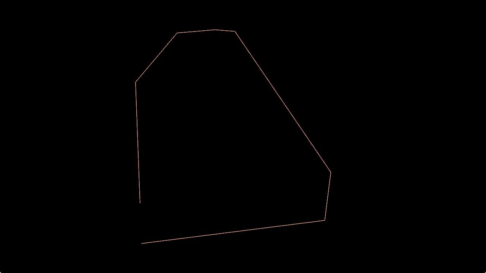
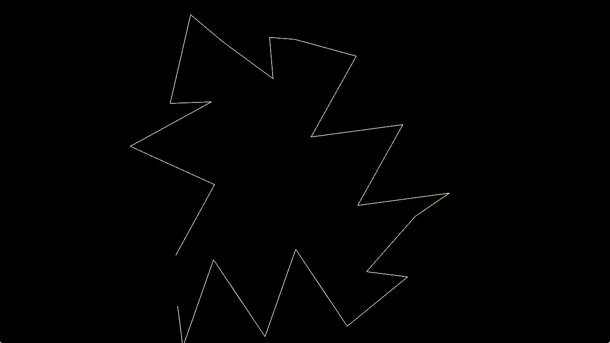
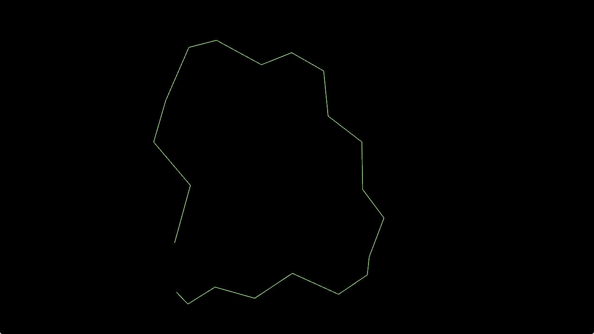
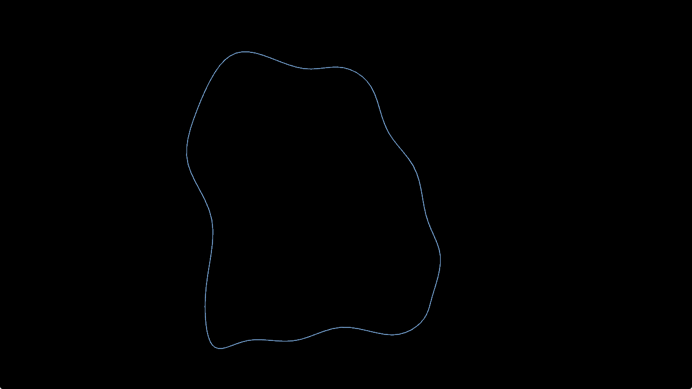

# Generate Random Loop  
Let's say we need a race track, and we need to get a random set  of points that describe it.

Please refer to example "basic"

```rust

    let mut rpath = RandomLoop::generate(12, vec3(100., 0., 100.));
    
``


```rust

    RandomLoop::vary(&mut rpath, 50.);
    
``


```rust

    RandomLoop::smooth_out(&mut rpath, 120f32.to_radians(), 20.);
    
``


```rust

        let cr = CubicBSpline::new(rpath).to_curve_cyclic().unwrap();
        let spline = cr.iter_positions(120).collect::<Vec<_>>();
   
``

